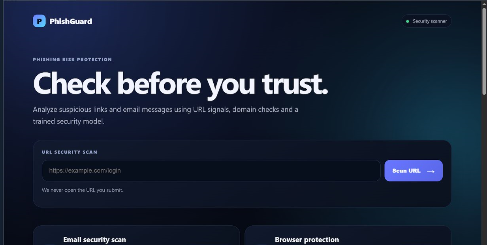
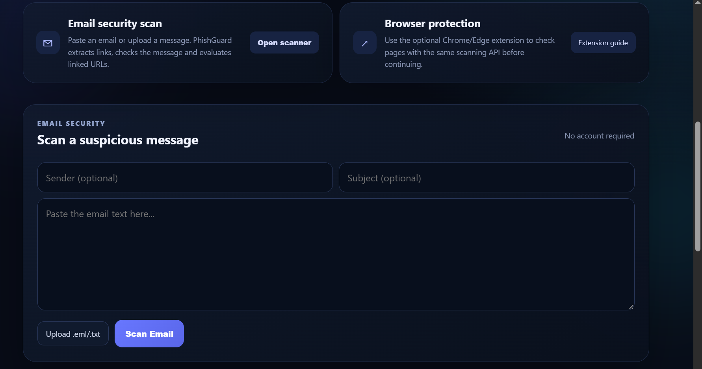
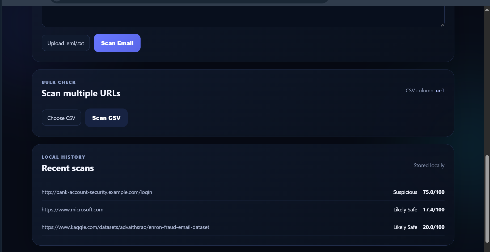
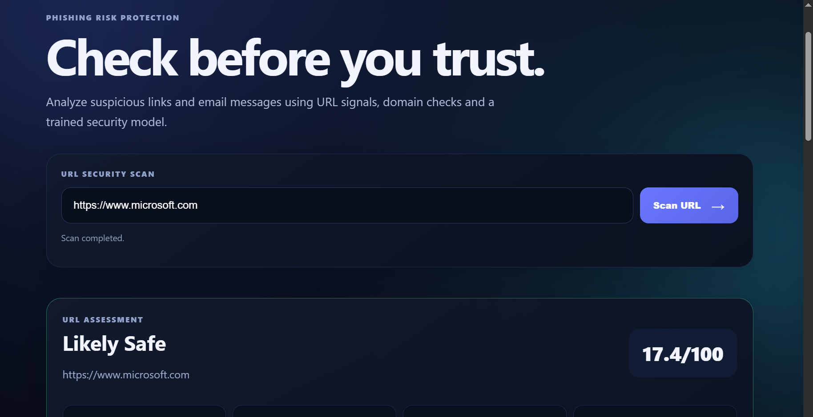
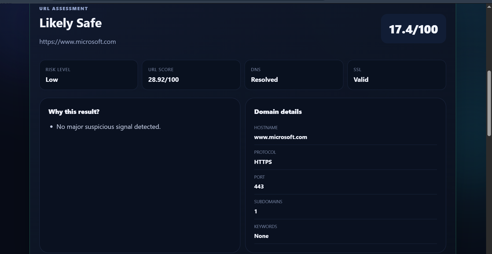
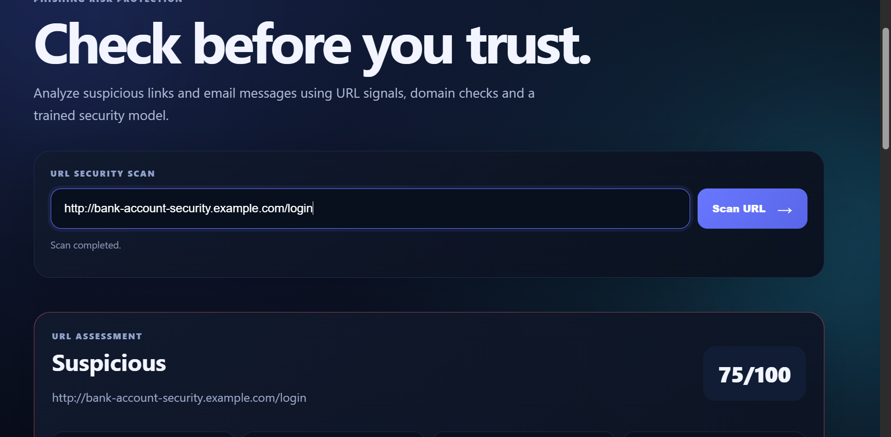
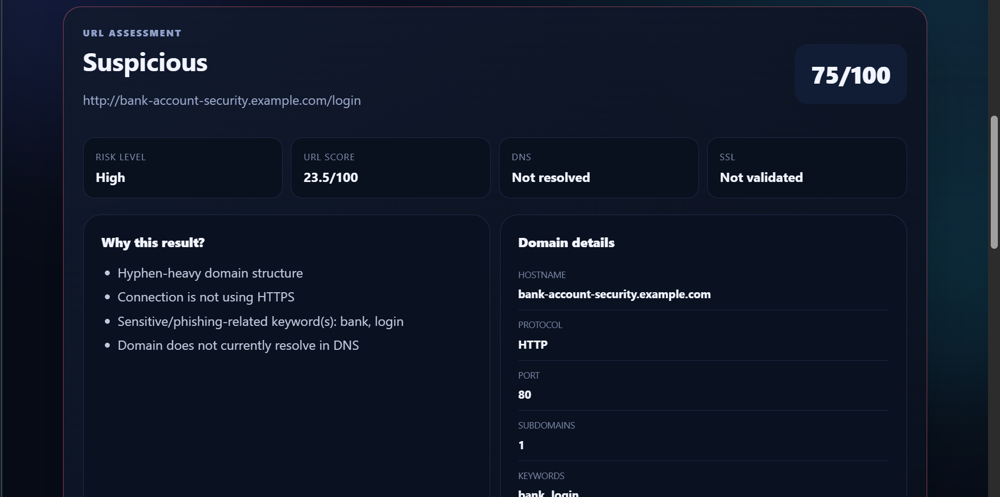
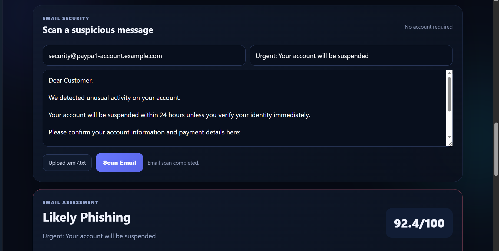
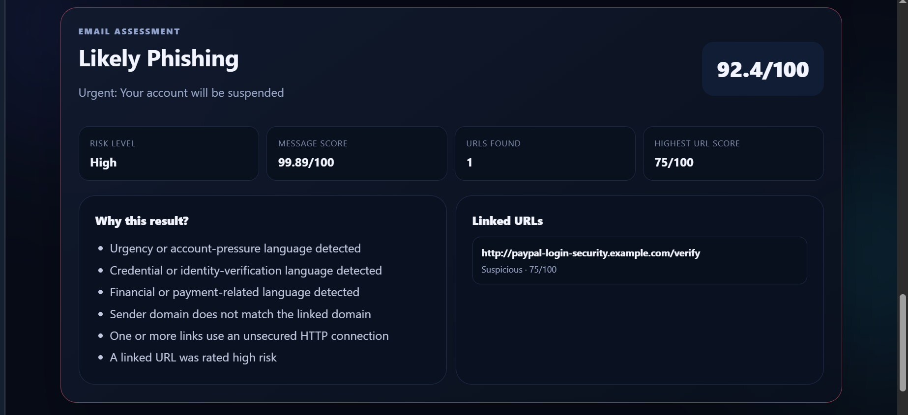

# PhishGuard — Explainable Phishing Risk Detection Platform

PhishGuard is a practical phishing-risk protection prototype that helps users check suspicious URLs and email messages **before they trust or open them**.

It combines URL structure analysis, DNS/SSL checks, deterministic security indicators, machine-learning models, email analysis, and linked-URL scanning to produce an explainable risk assessment.

> **Important:** PhishGuard is a security-assistance prototype. A low-risk result does not prove that a URL or email is completely safe.

---

## Why PhishGuard?

Phishing attacks commonly use malicious links, impersonated domains, urgent account messages, payment requests, and credential-stealing pages.

PhishGuard provides a detection layer between the user and the suspicious content:

```text
User
  │
  ├── URL
  │
  ├── Email
  │
  └── Browser Extension
          │
          ▼
    PhishGuard API
          │
     ┌────┴─────┐
     ▼          ▼
 URL Analysis  Email Analysis
     │          │
     │          ├── Message model
     │          └── Extract linked URLs
     │                    │
     ▼                    ▼
 DNS / SSL             URL Analysis
     │                    │
     └────────┬───────────┘
              ▼
       Explainable Risk
          Assessment
```

---

## Key Features

- 🔎 Single URL security scanning
- 📧 Email phishing-risk scanning
- 🔗 Automatic URL extraction from emails
- 🧠 Separate URL and email classification models
- 🌐 DNS and SSL/TLS checks
- 🛡️ Deterministic phishing indicators
- 💳 Banking, UPI, KYC, OTP, payment and credential indicators
- 📊 Bulk CSV URL scanning
- 🌍 Optional Chrome/Edge Manifest V3 browser extension
- 🔌 JSON API for integration with security workflows
- 📝 Explainable reasons for every assessment
- 👤 No login or account required
- 📱 Responsive security-focused UI

---

# Application Screenshots

The following screenshots are included in `docs/screenshots/`.

## 1. Main PhishGuard Interface

The landing page provides the primary URL security scanner and introduces the phishing-risk protection workflow.



## 2. Email Security Scanner

The email scanner allows users to enter a sender, subject, and email body or upload an `.eml`/`.txt` message for analysis.



## 3. Bulk URL Scanning and Recent History

The application also supports bulk URL checks through CSV files and shows recent local scan results for development/testing.



---

# Test Results

The following screenshots show **separate test runs** performed independently to demonstrate different PhishGuard capabilities. The tests were not executed as a single sequential test flow.

## 4. Safe URL — Microsoft

A legitimate HTTPS Microsoft URL was tested independently:

```text
https://www.microsoft.com
```

The application returned:

```text
Likely Safe
Risk Score: 17.4/100
```

The result also showed:

- DNS: Resolved
- SSL: Valid
- HTTPS protocol
- No major suspicious signal detected



## 5. Safe URL — Detailed Assessment

The detailed assessment confirms the low-risk result and shows the domain information used during the analysis.

The result demonstrates that PhishGuard does not simply mark every URL as suspicious; it also identifies normal HTTPS domains with valid DNS/SSL signals as lower risk.



---

## 6. Suspicious URL — Bank Account Login

A controlled test URL was tested independently:

```text
http://bank-account-security.example.com/login
```

The application returned:

```text
Suspicious
Risk Score: 75/100
```

Reasons included:

- Hyphen-heavy domain structure
- Connection is not using HTTPS
- Sensitive keywords such as `bank` and `login`
- Domain does not currently resolve in DNS

The `.example.com` domain is used only for safe synthetic testing and should not be interpreted as a real malicious website.



## 7. Suspicious URL — Risk Assessment

The detailed URL assessment shows the combined risk decision and the supporting technical signals such as protocol, port, DNS status, hostname and suspicious keywords.



---

## 8. Phishing Email Detection

A phishing-style email was tested independently using an impersonated security sender and an account-suspension message.

The application returned:

```text
Likely Phishing
Risk Score: 92.4/100
```

Detected indicators included:

- Urgency/account-pressure language
- Credential or identity-verification language
- Financial/payment-related language
- Sender domain mismatch
- Unsecured HTTP link
- High-risk linked URL



## 9. Phishing Email — Explainable Result

The email assessment shows that the final decision is based on multiple observable signals rather than only a single keyword.

The linked URL was independently analyzed by the URL security engine, and its result contributed to the overall email assessment.



---

# Detection Models

## URL Model

The URL model is a Random Forest classifier trained on the UCI Phishing Websites feature set.

Recorded holdout metrics:

| Metric | Score |
|---|---:|
| Accuracy | 91.77% |
| Precision | 90.06% |
| Recall | 91.53% |
| F1 Score | 90.79% |
| ROC-AUC | 97.06% |

The URL model uses 14 URL/domain features including:

- IP address usage
- URL length
- URL shortening
- `@` symbol
- redirect patterns
- prefix/suffix structure
- subdomain information
- SSL state
- domain registration information
- port
- HTTPS token
- abnormal URL indicators
- domain age
- DNS record

These ML signals are combined with deterministic security checks such as suspicious keywords, URL structure, DNS status and TLS/SSL status.

## Email Model

The email classifier is separate from the URL model.

The current project records the following training setup:

- CEAS_08
- Enron
- Ling
- SpamAssasin
- phishing_email
- TF-IDF word features
- 15,000 maximum features
- Logistic Regression
- Stratified 80/20 holdout
- Random state: 42

Recorded holdout results:

| Metric | Score |
|---|---:|
| Accuracy | 98.85% |
| Precision | 98.66% |
| Recall | 98.97% |
| F1 Score | 98.82% |
| ROC-AUC | 99.91% |

A Linear SVM was also benchmarked and achieved a slightly higher F1 on the recorded holdout, but Logistic Regression was selected for the application because it provides a direct probability that can be converted into the application's risk score.

These are dataset-level holdout results and **not a guarantee of production performance**.

### Dataset handling

The main supervised training corpus uses datasets containing both classes.

`Nazario` and `Nigerian_Fraud` were inspected but excluded from the main supervised training split because they contain only positive labels.

The email model is independent of the URL model, while URLs extracted from an email are independently analyzed through the URL security engine.

---

# Risk Assessment

PhishGuard presents the user with a single overall risk score and a corresponding risk verdict.

The application is designed around simple user-facing outcomes such as:

- **Likely Safe**
- **Suspicious**
- **Likely Harmful**
- **Likely Phishing**

The detailed result also explains the observable reasons behind the decision.

The score should be treated as a risk indicator, **not a guarantee of safety**.

---

# API

## URL Scan

```http
POST /scan
Content-Type: application/json
```

Example:

```json
{
  "url": "https://example.com"
}
```

## Email Scan

```http
POST /scan-email
Content-Type: application/json
```

Example:

```json
{
  "sender": "security@example.com",
  "subject": "Account verification",
  "email": "Please verify your account at https://example.com"
}
```

## Health Check

```http
GET /health
```

The API allows the same detection engine to be consumed by the web application, browser extension, or future SOC/security integrations.

---

# Browser Extension

The `browser-extension/` directory contains a Chrome/Edge Manifest V3 prototype.

The extension:

1. Reads the current page URL.
2. Sends the URL to the PhishGuard API.
3. Receives the risk assessment.
4. Displays a warning for higher-risk pages.
5. Gives the user an option to go back or continue.

### Local setup

1. Start PhishGuard locally.
2. Open Chrome/Edge extension settings.
3. Enable **Developer mode**.
4. Select **Load unpacked**.
5. Select the `browser-extension` folder.

For a deployed installation, update the API endpoint in `browser-extension/content.js`.

---

# Run Locally

### 1. Create a virtual environment

```bash
python -m venv venv
```

### 2. Activate on Windows Git Bash

```bash
source venv/Scripts/activate
```

### 3. Install dependencies

```bash
pip install -r requirements.txt
```

### 4. Start the application

```bash
python app.py
```

### 5. Open

```text
http://127.0.0.1:8080
```

---

# Project Structure

```text
PhishGuard/
├── app.py
├── api/
├── browser-extension/
├── config/
├── models/
│   ├── phishing_url_model.pkl
│   ├── email_phishing_model.pkl
│   ├── metrics.json
│   └── email_metrics.json
├── src/
│   ├── email_security/
│   └── url_security/
├── static/
│   └── css/
├── templates/
│   └── prediction.html
├── docs/
│   └── screenshots/
├── requirements.txt
├── Dockerfile
└── vercel.json
```

---

# Security Design

- Submitted URLs are analyzed as data; PhishGuard does not intentionally open the submitted URL.
- DNS and TLS checks use bounded timeouts.
- A failed live check does not automatically prove that a URL is malicious.
- Email URLs are extracted and independently analyzed.
- User-controlled strings are escaped before being inserted into the result interface.
- The browser extension is a warning layer and does not claim guaranteed browser-level blocking.
- The application does not require users to create an account.

---

# Deployment Notes

The project includes API/serverless deployment configuration and can be adapted for platforms such as Vercel.

For production deployment, local scan history should be replaced with managed persistent storage because serverless instances do not provide reliable local filesystem persistence.

Recommended production improvements include:

- Rate limiting
- Centralized security logging
- Threat-intelligence feeds
- Fresh phishing datasets
- Model monitoring
- External validation
- Authentication for private API integrations
- Continuous model evaluation

---

# Limitations

PhishGuard is a **portfolio/educational security prototype**, not a replacement for an enterprise secure web gateway, endpoint security platform, or email security product.

The models were developed using historical/public datasets. Attack techniques change over time, so production deployment would require fresh data, external validation and continuous monitoring.

A low risk score does not prove that a URL or email is safe.

---

# Future Improvements

- Threat-intelligence API integration
- Domain reputation feeds
- Better external validation
- Model calibration and monitoring
- Enterprise SIEM/SOC integration
- Rate limiting and API abuse protection
- Production persistent storage
- Expanded browser-extension controls

---

# License

This project is intended for educational and portfolio use.
